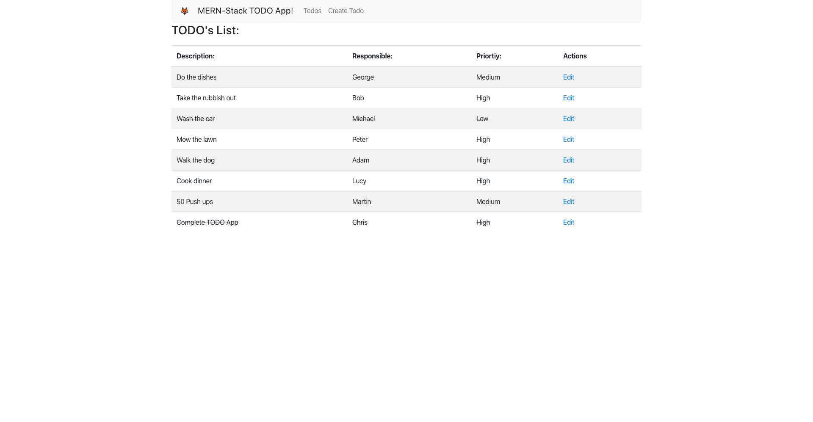
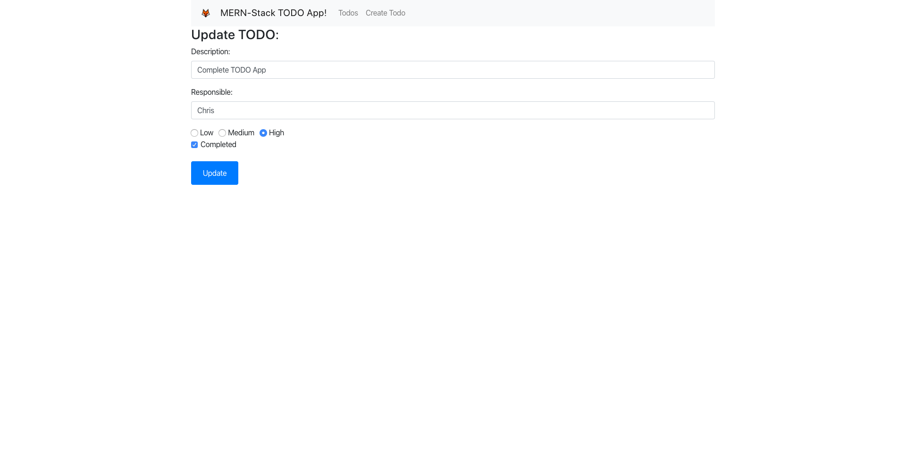
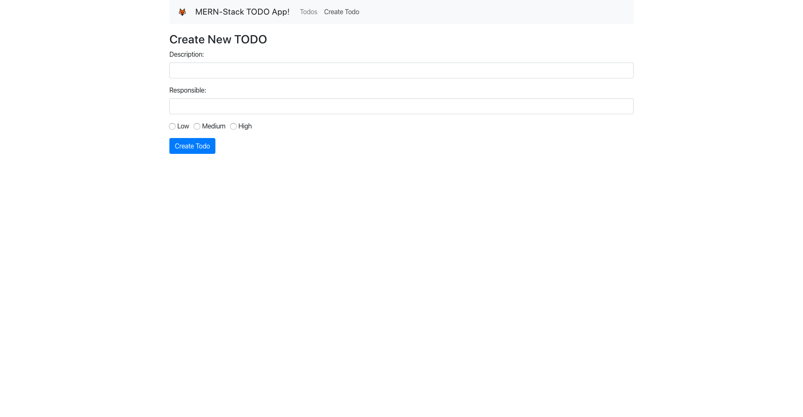

# TODO LIST MINI PROJECT - MERN Stack

### About The Project: 
This was a holiday project for me and an attempt to begin getting ready for my final assestment @ Coder Academy.  
I'm fairly new to JavaScript in general and this was my first time touching on the majoriy of the MERN stack, as well as the first time I had tried using Bootstrap CSS instead of writing it myself.
I found MongoDB difficult to impliment for the first time however this was mostly due to install issues with the new macOSX(Catalina) making it harder than it needed to be. 
React was quite cool to work with and it was cool seeing how something worked that was quite familiar after doing my Ruby on Rails web app.

### Screenshots:

### MERN Stack
- MongoDB
- Express.JS
- React.JS
- Node.JS

 
Below is some standard information:  

***

This project was bootstrapped with [Create React App](https://github.com/facebook/create-react-app).

## Available Scripts

In the project directory, you can run:

### `npm start`

Runs the app in the development mode. 
Open [http://localhost:3000](http://localhost:3000) to view it in the browser.

The page will reload if you make edits. 
You will also see any lint errors in the console.

### `npm test`

Launches the test runner in the interactive watch mode. 
See the section about [running tests](https://facebook.github.io/create-react-app/docs/running-tests) for more information.

### `npm run build`

Builds the app for production to the `build` folder. 
It correctly bundles React in production mode and optimizes the build for the best performance.

The build is minified and the filenames include the hashes. 
Your app is ready to be deployed!

See the section about [deployment](https://facebook.github.io/create-react-app/docs/deployment) for more information.

### `npm run eject`

**Note: this is a one-way operation. Once you `eject`, you can’t go back!**

If you aren’t satisfied with the build tool and configuration choices, you can `eject` at any time. This command will remove the single build dependency from your project.

Instead, it will copy all the configuration files and the transitive dependencies (Webpack, Babel, ESLint, etc) right into your project so you have full control over them. All of the commands except `eject` will still work, but they will point to the copied scripts so you can tweak them. At this point you’re on your own.

You don’t have to ever use `eject`. The curated feature set is suitable for small and middle deployments, and you shouldn’t feel obligated to use this feature. However we understand that this tool wouldn’t be useful if you couldn’t customize it when you are ready for it.
